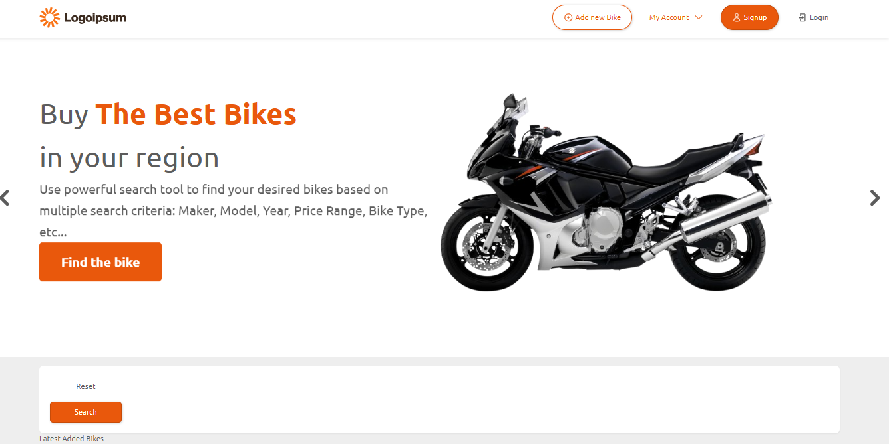
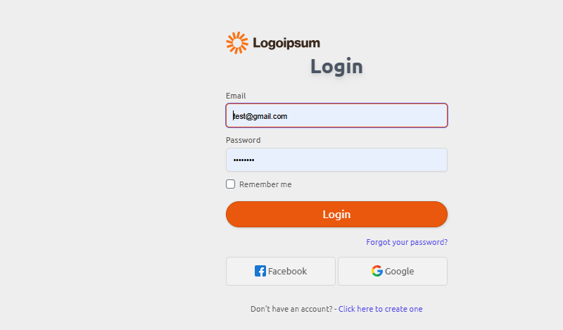
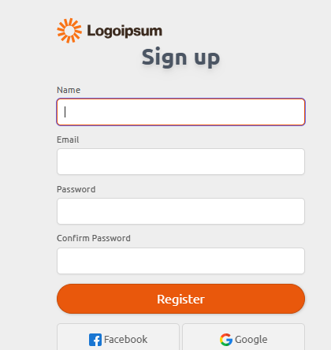
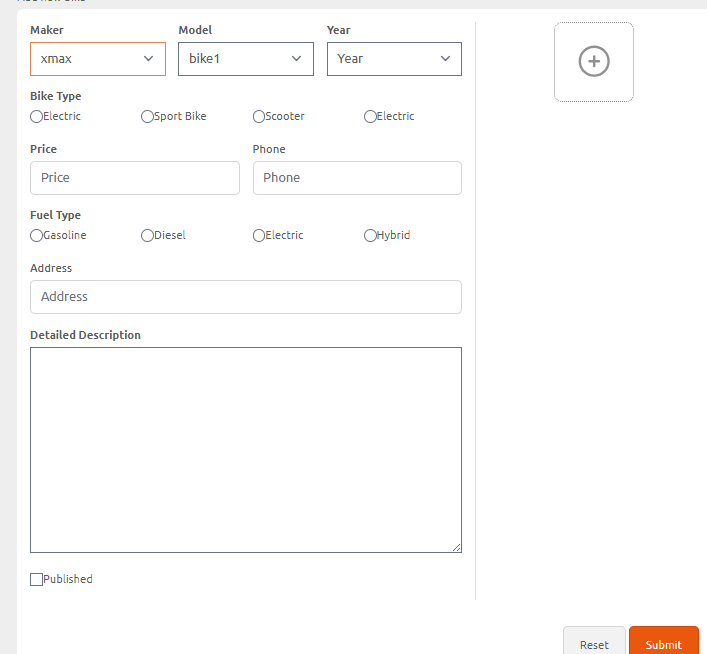

<h1>Logoipsum</h1>

an online selling platform for second hand bike

to get the system just do <bold>https://github.com/Jkianboringot/bike-online-store</bold>

cd bike-online-store 

compposer install & npm install

to start app, do php artisan serve & npm run dev , or if concurrent was installed 
    do <bold> npm run all</bold> which is just php artisan serve and npm run dev in one command

